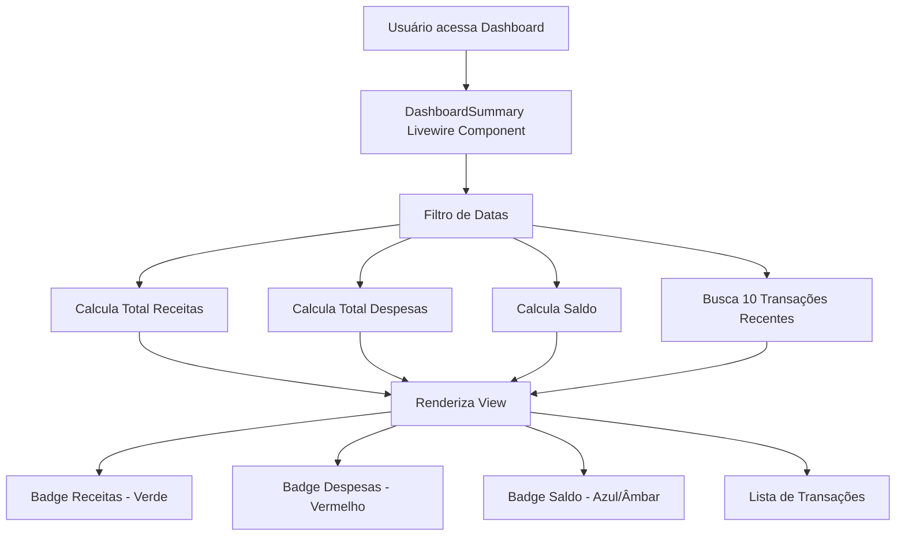

# Plano: Remoção de Despesas do Dashboard + Página de Receitas + Dashboard Financeiro

## Visão Geral

Este plano abrange três tarefas principais:
1. **Mover "Adicionar Despesa"** do Dashboard para página própria
2. **Criar Página de Receitas** seguindo o padrão Action + Livewire Form
3. **Criar Dashboard financeiro** com badges reativos de gastos/receitas/saldo + transações recentes

---

## 1. Dados do Projeto (Contexto)

### Modelo `Transaction`
- Campos: `id` (UUID), `type` (`out`/`income`), `value`, `name`, `description`, `expense_date`, `user_id`, `document_id`, `category_id`, `status`
- Relacionamentos: `user()`, `category()`, `document()`

### Padrões Existentes
- **Actions**: [`app/Actions/AbstractAction.php`](app/Actions/AbstractAction.php) — `rules()`, `execute(array $input)`
- **Livewire Forms**: [`app/Livewire/Forms/AbstractActionForm.php`](app/Livewire/Forms/AbstractActionForm.php) — `getAction()`, `submit()`
- **Páginas**: Blade view → `<x-app-layout>` → `<x-sidebar>` → `<livewire:component-name />`
- **Rotas**: Em [`routes/web.php`](routes/web.php), grupo `middleware('auth')`

### O que já existe
- [`ManageExpenses`](app/Livewire/Dashboard/ManageExpenses.php) — CRUD completo de despesas (create, read, update, delete)
- [`CreateExpenseTransactionForm`](app/Livewire/Forms/CreateExpenseTransactionForm.php) — form com `type = 'out'`
- [`UpdateExpenseTransactionForm`](app/Livewire/Forms/UpdateExpenseTransactionForm.php) — form de edição
- [`DeleteTransactionForm`](app/Livewire/Forms/DeleteTransactionForm.php) — form de exclusão
- [`CreateTransactionAction`](app/Actions/Transaction/CreateTransactionAction.php) — já suporta `type: out|income`
- [`UpdateExpenseTransactionAction`](app/Actions/Transaction/UpdateExpenseTransactionAction.php) — específico para `type = 'out'`
- [`DeleteTransactionAction`](app/Actions/Transaction/DeleteTransactionAction.php) — específico para `type = 'out'`
- [`UpdateTransctionAction`](app/Actions/Transaction/UpdateTransctionAction.php) — genérico (typo no nome, aceita qualquer type)
- [`dashboard.blade.php`](resources/views/dashboard.blade.php) — atualmente contém apenas `<livewire:dashboard.manage-expenses />`

---

## 2. Tarefa 1: Página Separada de Despesas

### 2.1. Mover o Livewire Component
O componente [`ManageExpenses`](app/Livewire/Dashboard/ManageExpenses.php) continuará existindo, mas será acessado via rota própria.

### 2.2. Criar View da Página
Criar [`resources/views/expenses/index.blade.php`](resources/views/expenses/index.blade.php):
```blade
<x-app-layout>
    <x-sidebar>
        <x-slot name="header">Despesas</x-slot>
        <div class="max-w-7xl mx-auto py-6 sm:px-6 lg:px-8">
            <livewire:dashboard.manage-expenses />
        </div>
    </x-sidebar>
</x-app-layout>
```

### 2.3. Criar Rota
Em [`routes/web.php`](routes/web.php) (grupo auth):
```php
Route::get('/expenses', function () {
    return view('expenses.index');
})->name('expenses.index');
```

### 2.4. Adicionar Link na Sidebar
Em [`resources/views/components/sidebar.blade.php`](resources/views/components/sidebar.blade.php), adicionar link "Despesas" após o link "Dashboard".

### 2.5. Atualizar Dashboard
Remover `<livewire:dashboard.manage-expenses />` do [`dashboard.blade.php`](resources/views/dashboard.blade.php) — será substituído pelo novo componente de resumo (Tarefa 3).

---

## 3. Tarefa 2: Página de Receitas (Incomes)

### 3.1. Actions

#### Criar [`app/Actions/Transaction/CreateIncomeTransactionAction.php`](app/Actions/Transaction/CreateIncomeTransactionAction.php)
- Estende [`AbstractAction`](app/Actions/AbstractAction.php)
- Rules: mesmas de `CreateTransactionAction` mas com `type` fixo como `'income'` OU reutiliza o `CreateTransactionAction` passando `type = 'income'`

**Abordagem recomendada**: Criar uma Action específica que defina `type = 'income'` automaticamente, evitando que o form precise expor esse campo. Exemplo:
```php
class CreateIncomeTransactionAction extends AbstractAction
{
    public function rules(): array
    {
        return [
            'value' => 'required|numeric|min:0.01',
            'description' => 'nullable|string|max:255',
            'expense_date' => 'required|date',
            'document_id' => 'nullable|uuid|exists:documents,id',
            'category_id' => ['required', 'uuid', Rule::exists('categories', 'id')->where('user_id', Auth::id())],
            'name' => 'required|string|max:255',
        ];
    }

    public function execute(array $input): mixed
    {
        $validated = $this->validate($input);
        Gate::authorize('create', Transaction::class);
        return Transaction::create([
            ...$validated,
            'type' => 'income',
            'status' => TransactionStatusEnum::PUBLISHED,
            'user_id' => Auth::user()->id,
        ]);
    }
}
```

#### Criar [`app/Actions/Transaction/UpdateIncomeTransactionAction.php`](app/Actions/Transaction/UpdateIncomeTransactionAction.php)
- Similar a [`UpdateExpenseTransactionAction`](app/Actions/Transaction/UpdateExpenseTransactionAction.php) mas com `->where('type', 'income')`

#### Criar [`app/Actions/Transaction/DeleteIncomeTransactionAction.php`](app/Actions/Transaction/DeleteIncomeTransactionAction.php)
- Similar a [`DeleteTransactionAction`](app/Actions/Transaction/DeleteTransactionAction.php) mas com `->where('type', 'income')`

### 3.2. Livewire Forms

#### Criar [`app/Livewire/Forms/CreateIncomeTransactionForm.php`](app/Livewire/Forms/CreateIncomeTransactionForm.php)
```php
class CreateIncomeTransactionForm extends AbstractActionForm
{
    #[Locked]
    public string $type = 'income';
    public string $name = '';
    public ?string $description = null;
    public string $value = '';
    public ?string $expense_date = null;
    public ?string $category_id = null;
    #[Locked]
    public ?string $document_id = null;

    public function getAction(): \App\Actions\AbstractAction
    {
        return app()->make(\App\Actions\Transaction\CreateIncomeTransactionAction::class);
    }
}
```

#### Criar [`app/Livewire/Forms/UpdateIncomeTransactionForm.php`](app/Livewire/Forms/UpdateIncomeTransactionForm.php)
- Similar a [`UpdateExpenseTransactionForm`](app/Livewire/Forms/UpdateExpenseTransactionForm.php) mas aponta para `UpdateIncomeTransactionAction`

#### Reutilizar [`DeleteTransactionForm`](app/Livewire/Forms/DeleteTransactionForm.php) ou criar `DeleteIncomeTransactionForm` apontando para `DeleteIncomeTransactionAction`

### 3.3. Livewire Component

#### Criar [`app/Livewire/Incomes/ManageIncomes.php`](app/Livewire/Incomes/ManageIncomes.php)
- Similar a [`ManageExpenses`](app/Livewire/Dashboard/ManageExpenses.php) mas para incomes
- Todos os métodos (`createIncome`, `startEditing`, `updateIncome`, `deleteIncome`, etc.) adaptados para `type = 'income'`
- `baseIncomesQuery()` filtra por `->where('type', 'income')`

### 3.4. View do Componente

#### Criar [`resources/views/livewire/incomes/manage-incomes.blade.php`](resources/views/livewire/incomes/manage-incomes.blade.php)
- Copiar estrutura de [`manage-expenses.blade.php`](resources/views/livewire/dashboard/manage-expenses.blade.php)
- Adaptar textos: "Nova receita", "Editar receita", "Total das receitas", etc.

### 3.5. Página e Rota

#### Criar [`resources/views/incomes/index.blade.php`](resources/views/incomes/index.blade.php)
```blade
<x-app-layout>
    <x-sidebar>
        <x-slot name="header">Receitas</x-slot>
        <div class="max-w-7xl mx-auto py-6 sm:px-6 lg:px-8">
            <livewire:incomes.manage-incomes />
        </div>
    </x-sidebar>
</x-app-layout>
```

#### Adicionar Rota em [`routes/web.php`](routes/web.php)
```php
Route::get('/incomes', function () {
    return view('incomes.index');
})->name('incomes.index');
```

### 3.6. Link na Sidebar
Adicionar link "Receitas" na sidebar entre "Dashboard" e "Importar documento" (ou após "Despesas").

---

## 4. Tarefa 3: Dashboard Financeiro com Badges Reativos

### 4.1. Livewire Component

#### Criar [`app/Livewire/Dashboard/DashboardSummary.php`](app/Livewire/Dashboard/DashboardSummary.php)

Propriedades principais:
```php
public ?string $dateFrom = null;
public ?string $dateTo = null;
```

`mount()`: definir `$dateFrom` e `$dateTo` com `now()->startOfMonth()->toDateString()` e `now()->endOfMonth()->toDateString()` usando Carbon.

Métodos reativos:
- `updatedDateFrom()` / `updatedDateTo()` — apenas resetar estado, o Livewire re-renderiza
- Poderiam usar `#[Computed]` para os totais, mas o padrão do projeto usa `render()`

`render()`:
```php
public function render(): View
{
    $userId = Auth::id();
    
    $totalExpenses = Transaction::query()
        ->where('user_id', $userId)
        ->where('type', 'out')
        ->whereBetween('expense_date', [$this->dateFrom, $this->dateTo])
        ->sum('value');
    
    $totalIncomes = Transaction::query()
        ->where('user_id', $userId)
        ->where('type', 'income')
        ->whereBetween('expense_date', [$this->dateFrom, $this->dateTo])
        ->sum('value');
    
    $balance = $totalIncomes - $totalExpenses;
    
    $recentTransactions = Transaction::query()
        ->with('category')
        ->where('user_id', $userId)
        ->whereBetween('expense_date', [$this->dateFrom, $this->dateTo])
        ->orderByDesc('expense_date')
        ->latest()
        ->limit(10)
        ->get();
    
    return view('livewire.dashboard.dashboard-summary', [
        'totalExpenses' => (float) $totalExpenses,
        'totalIncomes' => (float) $totalIncomes,
        'balance' => (float) $balance,
        'recentTransactions' => $recentTransactions,
    ]);
}
```

### 4.2. View do Componente

#### Criar [`resources/views/livewire/dashboard/dashboard-summary.blade.php`](resources/views/livewire/dashboard/dashboard-summary.blade.php)

Estrutura:
1. **Filtro de Data** (2 inputs `type="date"` wire:model.live para `dateFrom` / `dateTo`)
2. **Badges/Cards** (grid 3 colunas):
   - Card "Receitas" (verde/success): `R$ {{ number_format($totalIncomes, 2, ',', '.') }}`
   - Card "Despesas" (vermelho/danger): `R$ {{ number_format($totalExpenses, 2, ',', '.') }}`
   - Card "Saldo" (primary ou accent): `R$ {{ number_format($balance, 2, ',', '.') }}`
3. **Lista de Transações Recentes**: tabela ou lista com nome, valor, tipo (com cor), data, categoria

### 4.3. Atualizar Dashboard

#### Modificar [`resources/views/dashboard.blade.php`](resources/views/dashboard.blade.php)
```blade
<x-app-layout>
    <x-sidebar>
        <x-slot name="header">Dashboard</x-slot>
        <div class="max-w-7xl mx-auto py-6 sm:px-6 lg:px-8">
            <livewire:dashboard.dashboard-summary />
        </div>
    </x-sidebar>
</x-app-layout>
```

---

## 5. Resumo das Alterações na Sidebar

A sidebar [`resources/views/components/sidebar.blade.php`](resources/views/components/sidebar.blade.php) deve ganhar **dois novos links**:

1. **Despesas** (após Dashboard) — `route('expenses.index')`
2. **Receitas** (após Despesas ou antes de Importar) — `route('incomes.index')`

Ordem sugerida:
```
Dashboard
Despesas      ← NOVO
Receitas      ← NOVO
Importar documento
Categorias
...
```

---

## 6. Arquivos que Precisam Ser Criados

| # | Arquivo | Descrição |
|---|---------|-----------|
| 1 | [`app/Actions/Transaction/CreateIncomeTransactionAction.php`](app/Actions/Transaction/CreateIncomeTransactionAction.php) | Action para criar receita |
| 2 | [`app/Actions/Transaction/UpdateIncomeTransactionAction.php`](app/Actions/Transaction/UpdateIncomeTransactionAction.php) | Action para atualizar receita |
| 3 | [`app/Actions/Transaction/DeleteIncomeTransactionAction.php`](app/Actions/Transaction/DeleteIncomeTransactionAction.php) | Action para excluir receita |
| 4 | [`app/Livewire/Forms/CreateIncomeTransactionForm.php`](app/Livewire/Forms/CreateIncomeTransactionForm.php) | Form Livewire para criar receita |
| 5 | [`app/Livewire/Forms/UpdateIncomeTransactionForm.php`](app/Livewire/Forms/UpdateIncomeTransactionForm.php) | Form Livewire para editar receita |
| 6 | [`app/Livewire/Incomes/ManageIncomes.php`](app/Livewire/Incomes/ManageIncomes.php) | Componente Livewire de gerenciamento de receitas |
| 7 | [`app/Livewire/Dashboard/DashboardSummary.php`](app/Livewire/Dashboard/DashboardSummary.php) | Componente Livewire do dashboard financeiro |
| 8 | [`resources/views/expenses/index.blade.php`](resources/views/expenses/index.blade.php) | View da página de despesas |
| 9 | [`resources/views/incomes/index.blade.php`](resources/views/incomes/index.blade.php) | View da página de receitas |
| 10 | [`resources/views/livewire/incomes/manage-incomes.blade.php`](resources/views/livewire/incomes/manage-incomes.blade.php) | View do componente de receitas |
| 11 | [`resources/views/livewire/dashboard/dashboard-summary.blade.php`](resources/views/livewire/dashboard/dashboard-summary.blade.php) | View do dashboard financeiro |

## 7. Arquivos que Precisam Ser Modificados

| # | Arquivo | Descrição |
|---|---------|-----------|
| 1 | [`resources/views/dashboard.blade.php`](resources/views/dashboard.blade.php) | Substituir `manage-expenses` por `dashboard-summary` + slot `header` |
| 2 | [`resources/views/components/sidebar.blade.php`](resources/views/components/sidebar.blade.php) | Adicionar links "Despesas" e "Receitas" |
| 3 | [`routes/web.php`](routes/web.php) | Adicionar rotas para `/expenses` e `/incomes` |

---

## 8. Fluxo do Dashboard (Mermaid)



---

## 9. Considerações Técnicas

1. **Reatividade**: Os filtros de data usam `wire:model.live` nos inputs, o que dispara re-renderização automática do Livewire sem necessidade de botão "Filtrar".

2. **Carbon**: `now()->startOfMonth()->toDateString()` e `now()->endOfMonth()->toDateString()` definem o período padrão.

3. **Padrão Visual**: Seguir os componentes Blade existentes (`<x-input>`, `<x-button>`, `<x-select.native>`) e tokens de cor do `app.css`.

4. **Nomenclatura**: Manter consistência — `'out'` para despesas, `'income'` para receitas (conforme já definido no banco).

5. **O Action `CreateTransactionAction` existente já suporta `type: out|income`**, mas para manter a separação de responsabilidades e evitar que o formulário exponha o campo `type`, criaremos `CreateIncomeTransactionAction` que fixa `type = 'income'`.
